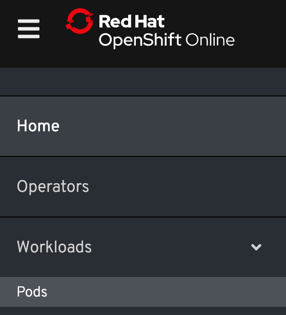
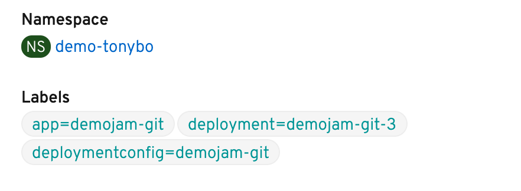
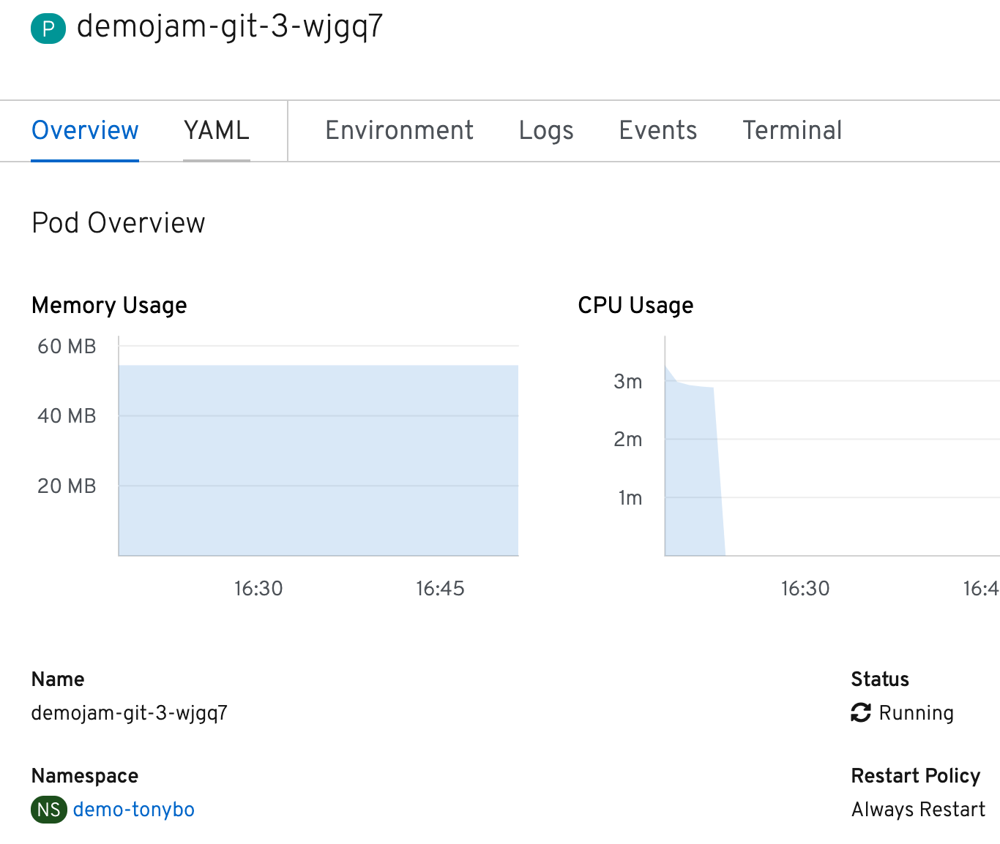
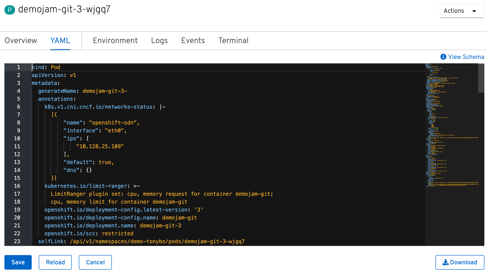
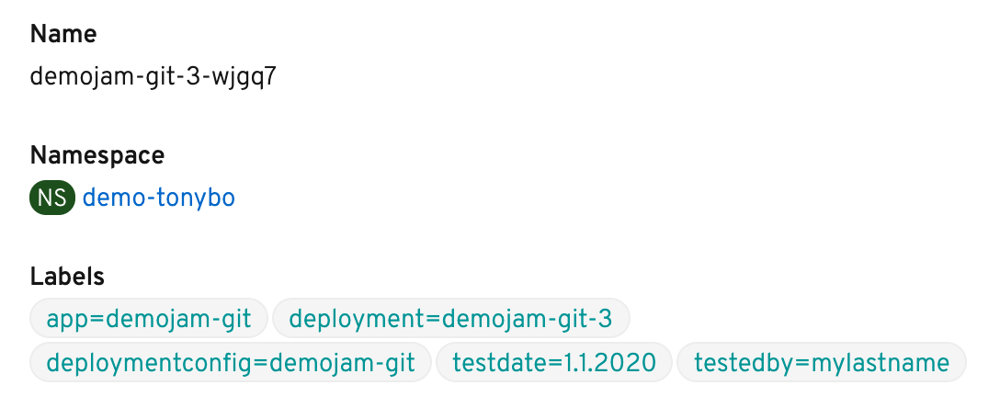

### Labels

This is a pretty simple lab, we are going to explore labels. You can use labels to organize, group, or select API objects.

For example, pods are "tagged" with labels, and then services use label selectors to identify the pods they proxy to. This makes it possible for services to reference groups of pods, even treating pods with potentially different docker containers as related entities.

#### Labels on a pod

In a previous lab we added our web app using a S2I template. When we did that, OpenShift labeled our objects for us. Let's look at the labels on our running pod.

##### *CLI Instructions (Option 1)*

In the terminal, run the following command:

```execute
oc get pods
```

```
oc describe pod/<POD NAME> | more
```

You can see the Labels automatically added contain the app, deployment, and deploymentconfig. Let's add a new label to this pod.

```
oc label pod/<POD NAME> testdate=1.1.2020 testedby=mylastname
```

Look at the labels

```
oc describe pod/<POD NAME> | more
```

Here's a handy way to search through all objects and look at all the labels:

```execute
oc describe all | grep -i "labels:"
```
<br>

##### *Web Console Instructions (Option 2)*

Inside the Admin View of the web console, click "Workloads" on the left side pane. Then, click on Pods in the dropdown: 



This is going to show basic details for all pods in this project


In the overview, scroll down and you should see all the labels on this pod:



Click on "YAML" next to "Overview" at the top:



You should be able to see all the details of the pod in a YAML format:



You will see all the labels under the metadata->labels section.

Add a new label into the labels section 

```
testdate: 1.1.2020 
testedby: mylastname
```


Your updated label will show up in the running pod's:



<br>

#### Summary

That's it for this lab. Now you know that all the objects in OpenShift can be labeled. This is important because those labels can be used as part of your CI/CD process. An upcoming lab will cover using labels for Blue/Green deployments. Labels can also be used for running your apps on specific nodes (e.g. just on SSD nodes or just on east coast nodes). 