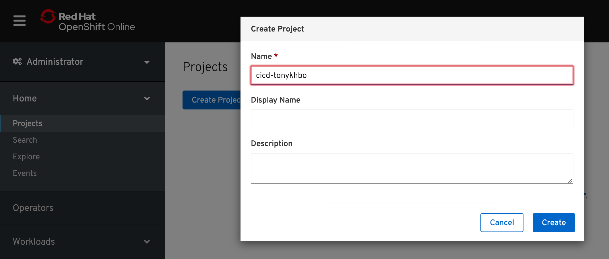
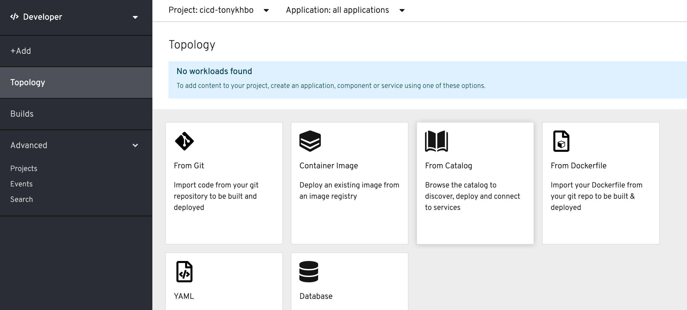
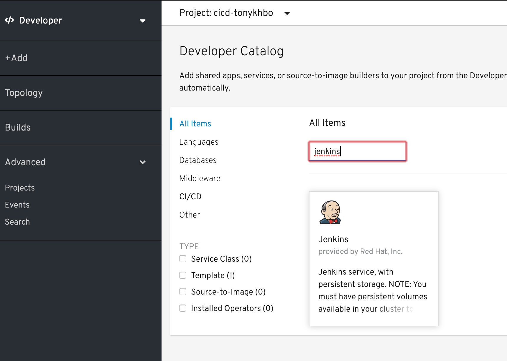
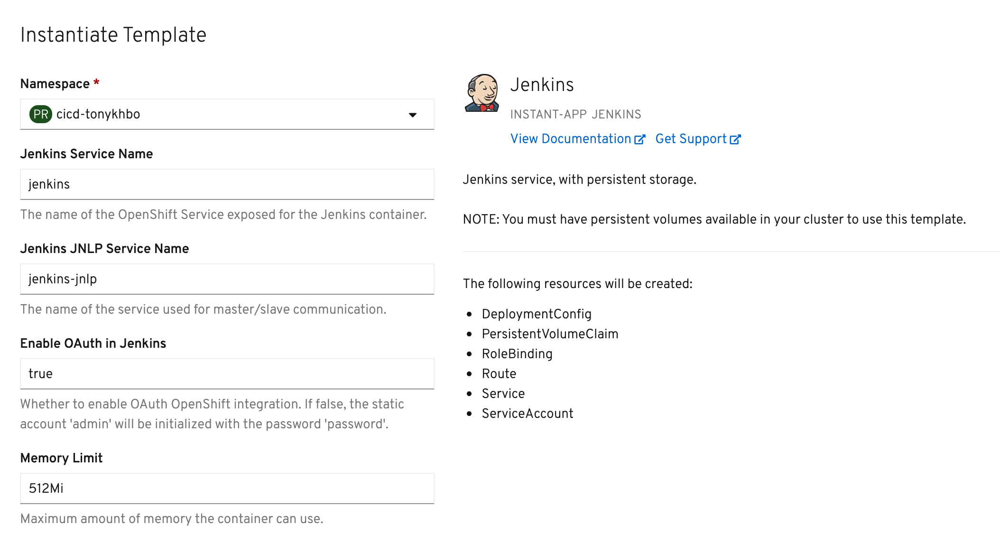
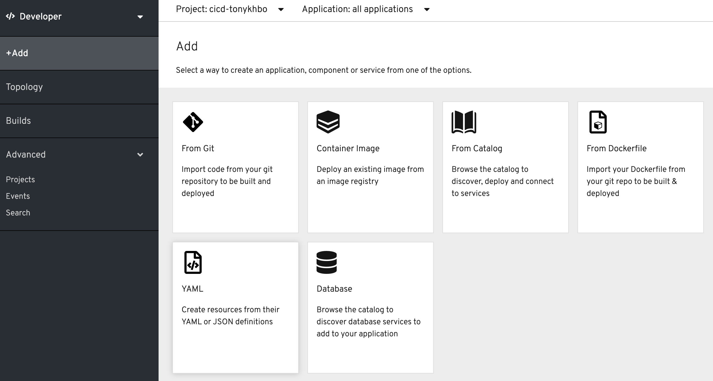
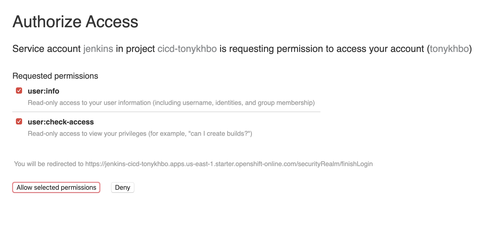

### CI/CD Defined

In modern software projects many teams utilize the concept of Continuous Integration (CI) and Continuous Delivery (CD). By setting up a tool chain that continuously builds, tests, and stages software releases, a team can ensure that their product can be reliably released at any time. OpenShift can be an enabler in the creation and management of this tool chain.

In this lab we walk through creating a simple example of a CI/CD pipeline utlizing Jenkins, all running on top of OpenShift! The Jenkins job will trigger OpenShift to build and deploy a test version of the application, validate that the deployment works, and then tag the test version into production.

#### Create a New Project

##### *CLI Instructions (Option 1)*

Create the project cicd-%username%

```execute
oc new-project cicd-%username%
```

##### *Web Console Instructions (Option 2)*

In the Admin View, click on "Home" and then click on "Projects" in the drop down. 

Click on "Create Project" and name it cicd-%username%: 



#### Use the cicd-%username% project 

##### *CLI Instructions*

```execute
oc project cicd-%username%
```

#### Instantiate a Jenkins server in your project

##### *CLI Instructions (Option 1)*

```execute
oc new-app jenkins-ephemeral
```

##### *Web Console Instructions (Option 2)*

From the Developer View, select your project, cicd-%username%.

Then click on "+Add" and then click on "From Catalog": 



In the catalog, search for jenkins or scroll down to find it: 



Click on Jenkins, click "Instantiate Template". 

Change Memory Limits to 512Mi and leave the rest of the fields as the default: 



Click "Create" at the bottom

<br>

#### Create a sample application config

##### *CLI Instructions (Option 1)*

Use the "oc new-app" command to create a simple nodejs application from a template file:

```execute
oc new-app -f https://raw.githubusercontent.com/openshift/origin/master/examples/jenkins/application-template.json
```

##### *Web Console Instructions (Option 1)*

From the Developer View, select your project, cicd-%username%.

Then click on "+Add" and then click on "YAML"



Navigate to https://raw.githubusercontent.com/openshift/origin/master/examples/jenkins/application-template.json

Copy the contents of the raw .json file and paste them:


#### Get Jenkins route

##### *CLI Instructions (Option 1)*

Get the route to the Jenkins server. 

```execute
oc get route
```

Your HOST/PORT values will differ from the example below:

##### *Web Console Instructions (Option 2)*


#### Log into Jenkins



#### Create a Jenkins pipeline using Openshift

##### *CLI Instructions (Option 1)*

##### *Web Console Instructions (Option 2)*

#### Start the pipeline

#### Confirm both the test and production services are available

##### *CLI Instructions (Option 1)*

##### *Web Console Instructions (Option 2)*

#### Edit the pipeline

##### *CLI Instructions (Option 1)*

##### *Web Console Instructions (Option 2)*

#### Summary

In this lab you have very quickly and easily constructed a basic Build/Test/Deploy pipeline. Although our example was very basic it introduces you to a powerful DevOps feature of OpenShift through the leveraging of Jenkins. This can be extended to support complex real-world continuous delivery requirements. 

